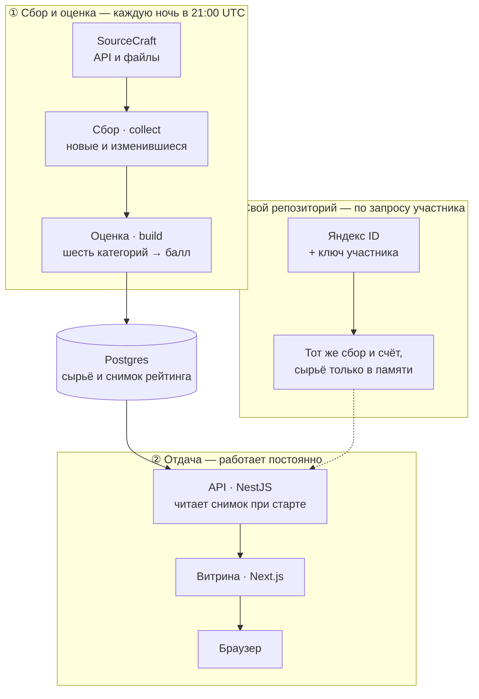

# Проба диаграмм — большая схема, крупнее

```mermaid
flowchart TB
    subgraph night["① Сбор и оценка — каждую ночь в 21:00 UTC"]
        direction LR
        SC["SourceCraft<br/>API и файлы"] --> C["Сбор · collect<br/>новые и изменившиеся"]
        C --> B["Оценка · build<br/>шесть категорий → балл"]
    end
    PG[("Postgres<br/>сырьё и снимок рейтинга")]
    subgraph serve["② Отдача — работает постоянно"]
        direction LR
        API["API · NestJS<br/>читает снимок при старте"] --> UI["Витрина · Next.js"]
        UI --> U["Браузер"]
    end
    subgraph own["Свой репозиторий — по запросу участника"]
        direction LR
        Y["Яндекс ID<br/>+ ключ участника"] --> P["Тот же сбор и счёт,<br/>сырьё только в памяти"]
    end
    B --> PG
    PG --> API
    P -.-> API
```
