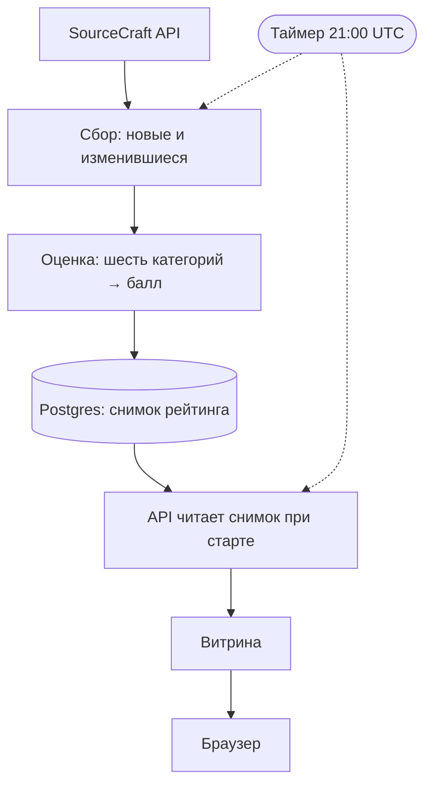
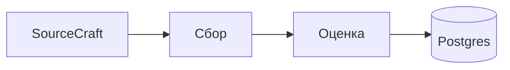
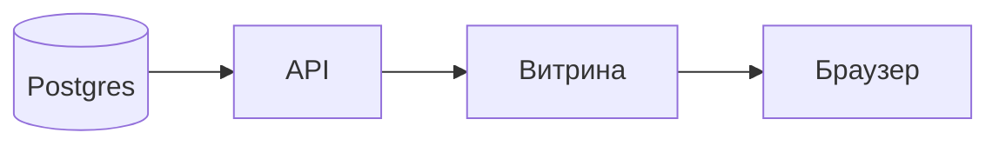
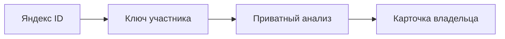

# Проба диаграмм — крупнее

## А. Одна схема сверху вниз

```mermaid
flowchart TB
    SC["SourceCraft API"] --> C["Сбор: новые и изменившиеся"]
    C --> B["Оценка: шесть категорий → балл"]
    B --> PG[("Postgres: снимок рейтинга")]
    PG --> API["API читает снимок при старте"]
    API --> UI["Витрина"]
    UI --> U["Браузер"]
    T(["Таймер 21:00 UTC"]) -.-> C
    T -.-> API
```

## Б. Три маленькие схемы

**Каждую ночь в 21:00 UTC**

```mermaid
flowchart LR
    SC["SourceCraft"] --> C["Сбор"] --> B["Оценка"] --> PG[("Postgres")]
```

**Всегда**

```mermaid
flowchart LR
    PG[("Postgres")] --> API["API"] --> UI["Витрина"] --> U["Браузер"]
```

**Свой репозиторий**

```mermaid
flowchart LR
    Y["Яндекс ID"] --> K["Ключ участника"] --> A["Приватный анализ"] --> R["Карточка владельца"]
```
